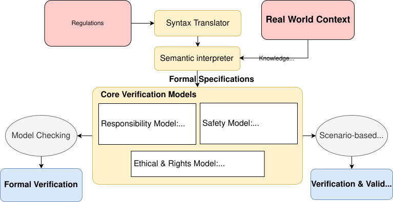

# Why Formalizing Regulations Is So Difficult?

> “The limits of my language mean the limits of my world.”  
> — Ludwig Wittgenstein, Tractatus Logico-Philosophicus

*If language sets the limits of what we can express, formal logic sets the limits of what we can prove. But is proof enough for expression?*

## Formalizing for what?

An automated driving system (ADS) does not operate in a regulatory vacuum. If we want to determine whether an ADS complies with a traffic rule, a safety requirement, or some other normative constraint, that requirement must eventually become something a machine can interpret, monitor, test, or verify.

At first sight, the path seems straightforward:

**Regulation → Formalization → Machine-checkable specification → Model checking → Verification**

But this apparently simple transition hides a much harder problem.

### A Kick-off Example

Let's consider an intuitive but popular case:

> **Maintain a safe distance.**

It sounds perfectly understandable to a human driver. But how exactly should a machine understand this? For example:

- Which distance? 
- Measured from where to where? 
- At what speed? 
- Under what road conditions? 
- What threshold determines "safe" or not?
- Which scenarios make it a meaningful representation?

A formula can calculate a quantity precisely. But it does not tell us whether the quantity represents what the regulation actually means. This is where the distinction between **syntax and semantics** becomes important.

### The Real Challenges

The **syntactic problem** is relatively familiar: translate natural-language requirements into predicates, conditions, temporal relations, thresholds, and constraints.

The **semantic problem** is deeper.

A formal expression can be perfectly well-formed and mathematically precise, even the encoded interpretation of the real-world requirement may remain questionable. For example, whether a formal expression really implies what the rule means, or whether a threshold is reasonably set.

Therefore, formalizing a regulation involves two distinguished layers:

- Syntax layer: translating regulations into well-formed expressions.

- Semantic layer: intepreting the real meaning of in the regulations in real world.

The former is a visible problem that make the resulting specifications "look nice". The latter is the submerged problem that require the results to have correct meanings.

## What Are Exactly Formalized?

Once we look at the semantic layer, several difficulties become impossible to ignore. We should carefully think about whether formal methods are the proper tools to take care of them.

### Ambiguity

Practcal regulations usually contain a lot of expressions that seem to be "fuzzy" or "ambiguious", such as *safe distance*, *reasonable care*, *appropriate speed*, or *as soon as practicable*. These expressions are not necessarily poorly written. Their flexibility can be intentional.

A regulation has to remain applicable across a wide range of situations while leaving room for contextual interpretation. If every possible circumstance were enumerated explicitly, the resulting rulebook would become both enormous and brittle.

This is not because the language is weak, it is because the space of the possible contexts is infinite.

This creates an interesting consequence for formalization.

There may be several syntactically precise ways to encode the same sentence, while those encodings impose materially different behavioral boundaries.

The ambiguity, therefore, is not necessarily a defect in the syntax of the regulation, but can be a property of its semantics.

Consider a simplified rule:

> **A vehicle should maintain a safe distance with the front vehicle.**

The syntax is relatively clear. We can represent it as simply as: $\square \, d > d_{\mathrm{threshold}}$ . But what exactly is $d_{\mathrm{threshold}}$ ?

This simple threshold may actually depend on an unbelievably enormous contextual space that contains road geometry, weather, vehicle state, traffic conditions, and the behavior of other road users —— by the way, “*Anticipated behavior*” here introduces another layer of uncertainty, which is also a huge topic to discuss. We will leave it for future.

Therefore, even apparently simple concepts such as “safe distance” may depend on assumptions about reaction time, available braking capability, visibility, and the behavior of surrounding agents.

The problem is therefore not that formal languages such as temporal logic are incapable of representing context. The problem comes even earlier:

> **Where does the semantic content of the context come from?**

A formally precise expression is only as meaningful as the semantic assumptions used to construct it. In other words, semantics is the bottleneck, syntax not.

### Contextual Interdependence

There is another complication. Regulations do not exist independently from one another.

Instead, a rule may depend on exceptions in another rule, precedence relationships, road conditions, right-of-way conventions, or assumptions about the same traffic participants. Several rules may refer to the same vehicle, pedestrian, lane, intersection, or traffic state.

In other words, rules are coupled through shared context.

We are therefore not merely translating sentences into formulas. We are reconstructing an interpretation system with contextual dependencies, decision thresholds, uncertainty, and interactions among agents.

So, the question has consequently changed. It is no longer simply about "How to encode a sentence in natural language", but also about "What meaningful commitment is made". This then leads to a more fundamental question.

> When we attempt to formalize a regulation, **are we actually formalizing the regulation itself?**

### The Actual Boundary

A formal specification is better understood as **a particular interpretation** of a regulation, under **a particular operational context**, for **a particular system**.

This distinction matters because regulations and formal specifications serve **different purposes**.

Regulations are primarily written for human interpretation and institutional application. Formal specifications are constructed for machine reasoning, testing, verification, or implementation. They belong to different representational regimes.

Formalization is therefore not a neutral translation from one language into another. Its purpose should be carefully confined within the boundary of **an act of interpretation.**

Once we accept this, the anchor of formalizing, or interpreting regulations is settled by the following two questions.

#### 1. **Interpretation for whom?**

The same regulation might need to be operationalized for system development, verification and validation, certification, regulatory assessment, human communication, or post-incident analysis. The intended purpose influences how much semantic flexibility must be compressed into explicit operational rules.

#### 2. **Who is authorized to make that interpretation?**

An engineer can design a formalization. A system developer can turn it into operational behavior. A verifier can establish whether the system satisfies the resulting specification. But none of these technical capabilities, by themselves, establish that the interpretation is an authoritative representation of the regulation.

At this point, the bottleneck begins to move:

- It is no longer simply a technical problem of formal-language design.

- It becomes a problem of **authorized semantic interpretation** which is impossible to be perfectly resolved merely with the efforts of technical development.

## What Is Formal Verification Really For?

This distinction gives us a useful way to think about the real purpose and function of formal verification.

Rather than asking immediately whether an ADS can be formally verified, it may be better to ask what must already be determined before verification can meaningfully begin.

### Four Boundaries Are Particularly Useful

#### **1. The Objective of Verification**

It must be highlighted that the objective of verification is not "judging whether a car violates a certain rule", but to place an argument about the target system with convincing evidence.

Safety engineering already works extensively with this kind of boundary.

ISO 26262 addresses hazards associated with malfunctioning behavior, while ISO 21448, or SOTIF, addresses unreasonable risk arising from insufficiencies in the specification or performance of intended functionality. More recently, ISO/TS 5083:2025 provides an ADS-oriented framework covering safety by design, verification, validation, and post-deployment activities for Level 3 and Level 4 ADS.

Responsibility-sensitive approaches such as RSS provide another example: instead of attempting to define every desirable driving behavior, they formulate explicit constraints on behavior that should be considered irresponsible or unsafe.

Instead of verifying "whether the ADS violates a regulation", a more tractable task for formal verification should be "whether the behavior of the ADS exposes high risk of insufficient functionality or unacceptable responsibility".

This establishes the first boundary:

> **The verification objective must be defined before it can be verified.**

Verification is impossible without a clear objective.

#### **2. The Domain of Context**

ADS engineering already has a powerful concept for restricting context: the **Operational Design Domain**, or ODD. An ODD specifies the conditions under which an automated driving feature is intended to operate.

This is an important step because it prevents us from asking whether a system is safe “**in general**”. We can instead ask whether it satisfies certain properties within a defined operational domain.

But an ODD does not necessarily capture the entire semantic state of a traffic interaction.

Knowing that an ADS operates on a divided highway in daylight and dry weather does not completely describe what happens when another vehicle cuts in, when two agents have competing intentions, or when the behavior of one road user changes the feasible actions of another.

This is where the interpretation problem becomes fundamentally multi-agent.

The issue is not that existing safety frameworks ignore interaction. On the contrary, contemporary ADS safety evaluation explicitly considers interactions with other road users. UNECE Regulation No. 157, for example, includes real-world assessment of vehicle behavior in response to other road users and scenarios such as following, cut-in and cut-out behavior.

These requirements highlight:

> **The relevant context with clear operation boundaries, including the assumptions about other agents within that context, must be sufficiently specified.**

Verification is not tractable without well-defined operation boundaries.

#### **3. The Semantic Commitment**

Here comes to the place where the academia has kept making efforts in.

Predicates, logical operators, temporal relations, numerical thresholds, state transitions, constraints, preconditions, and postconditions can all be used to construct a formal specification.

There is already a substantial body of research demonstrating that traffic rules and safety requirements can be represented using formal methods.

But the important question is not whether formal syntax is expressive enough in principle, but **which semantic commitments have already been fixed even before?**

Like "Keeping safe distance" could be either $\square \, d > d_{\text{threshold\_in\_general}}$ or $(\square \, \text{Front\_Car\_Cutin} \rightarrow d > d_{\mathrm{threshold\_for\_cutin}}) \wedge (\square \, \text{Front\_Car\_Braking} \rightarrow d > d_{\mathrm{threshold\_for\_braking}})$, both with correct syntax but of different semantic interpretation due to different definition of thresholds.

Distinguished semantic commitments is exactly why different researchers have induced different forms of formal specifications even from the same rule.

So the boundary becomes:

> **Semantic interpretation must be determined before syntax is formalized.**

Arguing "which syntax is correct or best" is meaningless unless semantic interpretation is well defined.

#### **4. When "Formal" Verification is not Feasible**

Now we arrive at the classical verification problem.

Given a specification and a system model, verification can be formulated as a model-checking problem. It may still suffer some technical difficults, such as scalability, but how to implement it seems to be straightforward.

However, what if a precise system model is difficult to obtain at all?

Not every ADS property can realistically be established through a complete proof of correctness by construction. The state space may be enormous; the model may be necessarily abstract; and the assumptions required for an exhaustive proof may themselves become too restrictive.

This is why verification increasingly operates together with scenario-based testing and validation.

ISO 34502:2022, for example, defines a scenario-based safety evaluation framework for ADS development. It explicitly structures safety evaluation around scenarios rather than attempting to establish safety through a single universal proof.

UNECE regulatory practice reflects a similar pattern. For ALKS, the regulatory assessment can involve documentation, virtual or physical testing, additional scenario assessment, and real-world testing. The real-world assessment is explicitly used to complement the documented and other test-based assessments.

Therefore, it is not about "formal verification **versus** testing", but about **what level of assurance can be established for a given specification, system, and scenario space, if formalization is too expensive?**

This gives us the final boundary:

> **Verification can be established through a test-based approach, if a formal one is not tractable.**

### A Conceptual Workflow With Clear Boundaries

These four aspects make the boundary of formal verification visible, based on which the following conceptual graph can be derived.

At the top sits the **regulation**, which is converted to formal specifications through two sub-processes: syntax translator and semantic interpreter. The former only takes care of the correctness of the syntax, while the latter should also incorporate the context of the real world. 

Note that syntax translation and semantic interpretation may involve two distinguished groups of experts. Moreover, a **knowledge base** storing ground truth of the real world will be very helpful to facilitate the process of semantic interpretation.

The formal specifications will be delivered to an interesting component called Core Verification Models, where verification process occurs. This component may contain different purpose-specific models, such as:

* **Responsibility Model**, such as RSS-inspired responsibility constraints;
* **Safety Model**, drawing on frameworks such as ISO 26262, ISO 21448/SOTIF, ISO/TS 5083 and applicable UNECE requirements;
* **Ethical & Rights Model**, potentially grounded in legal and fundamental-rights requirements such as the EU AI Act.

Each model has a clear and specific objective: either responsibility-oriented, safety-oriented, or ethics-oriented. Its operation domain can be clearly specified with a certain ODD.

Moreover, the syntax part and semantic part of regulation interpretation are separated, where the challenge of semantic interpretation is leveraged by a dedicated knowledge base.

If a simple and precise system model exists, formal verification can be performed with model checking. Otherwise, scenario-based testing procedure can be proceeded, which fall into a standard verification and validation (V&V) process.

Note that the formal specifications derived from regulations are not necessarily complete nor sound to the original regulations, because **the target of verification is not to prove that regulations are satisfied, but to show evidence that the verification objective is achieved**.

Note that this graph does not intend to suggest any specific solutions. What makes it interesting is that a clear boundary is settled. Within the **Core Models** lies the real verifiation processes which is rigorous—and increasingly automated. Outside lies the procedures where non-technical groups of experts and agencies are involved. However, the conversion of regulations to specifications is not that challenging since a much smaller objective and scope of verification are determined by the core models, compared to the conventional.

RSS is an excellent example to fit this model. xxxxx 【please help me 补齐这段内容，不用多，几乎话讲明白就好】

### A Step Further Towards A Knowledge Base

Let's explore a little bit about another interesting part of the diagram: the **knowledge base** that structures the complexity of real-world contexts, such that semantic interpretation of formal specifications is eased.

Such a knowledge base might represent road and environmental conditions, traffic rules, entities and relationships, agent roles, behavioral assumptions, scenario semantics, exceptions, and dependencies among regulatory sources.

This immediately raises an obvious question with emerging AI:

**Could a large language models do this?**

Potentially, yes.

Their strength is exactly the ability to process enormous amounts of heterogeneous language and connect information across documents, concepts, and contexts. This makes them attractive at the context-to-interpretation interface.

But the downside is: an LLM may NOT understand ground truth. It can guess something is very likely to be true because it is said to be true everywhere. But it can never understand why it is true. This means an LLM can never believe something is absolutely true. This is fatal to verification.

A mediated chain involving structured knowledge bases, ontologies, scenario representations, retrieval and grounding, domain-specific reasoning, rule engines, formal constraints, and human validation. In such a system, the LLM would not necessarily become the final authority on meaning.

It could instead help construct, organize, retrieve, and navigate the knowledge representation from which interpretation can be made explicit.

Therefore, the challenge is not merely making language machine-readable, but **making semantics sufficiently explicit that mathematical reasoning becomes legitimate**.

## Looking Beyond Formalization

At this point, it is tempting to continue pushing the mathematics.

- Can we formalize more rules?
- Can we expand the model?
- Can we cover more contexts?
- Can we make the specification more complete?

When the transition from regulation to formal methods becomes increasingly difficult, perhaps it is worth lifting our eyes from the immediate problem and looking at the boundary itself.

A regulation contains more than its explicit rules. It also contains a latent structure:

* assumptions about context;
* normative boundaries;
* implicit responsibilities;
* exceptions;
* relationships among agents;
* notions of acceptable behavior;
* thresholds whose meaning depends on operational circumstances;
* ...

Some of them can be made explicit, some can even be formalized, some may remain dependent on interpretation and evidence, and some may be better addressed through testing, monitoring, or institutional judgment than forced into a formal specification.

Moreover, the objective of verification is even not necessarily **checking who has violated which rule** —— that is the job of policemen and lawyers. The objective of verification should remain in **placing sound arguments based on convincing evidence**. Regulations are just part of the sources of evidence. 

In the end, the report is submitted to certified bodies, not traffic agency nor the court.

Thus, a more interesting question may be:

> **What needs to become explicit before formal reasoning becomes useful?**

It is even not necessarily be part of the regulation, may be just a partition of the latent structure of the regulation that aligns with a specific verification objective —— responsibility, safety, or ethics.

After all, the goal is not to turn the entire regulatory world into mathematics, but to recognize where mathematical rigor can actually strengthen a certain argument.

